IA(무엇이 존재하는지)

1. IA 구조에서 명사 찾기(동사/속성 제외)
    
    : 미션, 리뷰, 가게, 포인트
    
2. 저장이 필요한지 체크(여러 개 존재? 각각 식별? 데이터 변화 이력이 쌓여야 하나?)
    
    : 현재 내 포인트 관리 부분은 설계 하지 않아도 되므로 속성으로 판단할 경우 미션, 리뷰, 가게
    
3. IA 페이지 내 CRUD 동사 찾아 추가 확보 : x

⇒ IA의 경우 **미션, 리뷰, 가게 개체**

WF(사용자가 무엇을 입력/조작하는지)

1. 입력 폼의 필드 묶음 찾기(폼 하나는 개체 하나고 필드들은 속성)
    
    : 회원(이름, 성별, 생년월일, 주소, 선호하는 **음식** 종류, 약관), 문의(문의 제목, 문의 유형, 문의 내용, 사진), 리뷰(별점, 리뷰 내용, 사진)
    
2. 목록/카드 UI 찾기(반복 되는)
    
    : 미션(전체 달성 수 제시), 회원(포인트, 휴대폰번호, 이메일, 닉네임, 작성한 리뷰- **리뷰 답글**, 작성한 문의 내역, 로그아웃, 계정 탈퇴)
    
3. 버튼/액션이 연결하는 두 명사 찾기(ex A를 B에 담기)→매핑 테이블 잡음 
    
    : 미션_수행 (회원이 미션 수행함 / 어떤 미션(가게명,미션), 진행 단계), 음식_선호도 (선호하는 음식 종류 여러개 고름)
    

⇒ WF의 경우 **회원, 문의, 리뷰, 미션, 음식_카테고리, 리뷰답 개체 / 미션_수행, 음식_선호도 매핑 테이블**

IA, WF의 결과로 개체 **회원, 미션, 가게, 리뷰, 문의, 음식_카테고리**로, 매핑 테이블 **미션_수행, 음식_선호도**로 두고 ERD 구현 시작

### 개체

1. **회원**

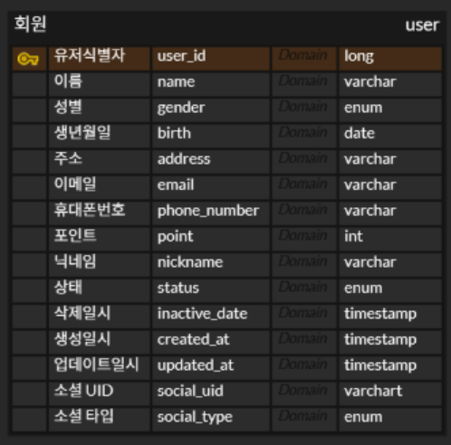

질문?! 일시들의 timestamp vs datetime 

⇒ datetime — 그냥 입력한 날짜/시간 그대로 저장, timestamp — 저장할 때 자동으로 UTC 기준으로 변환해서 저장, 조회할 때 서버 시간대에 맞게 변환해서 보여줌

2. **미션**

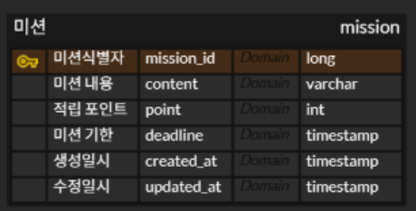

3. **가게**

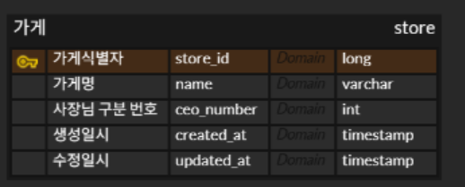

4. **리뷰**

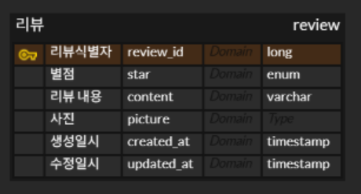

5. **리뷰 답글**

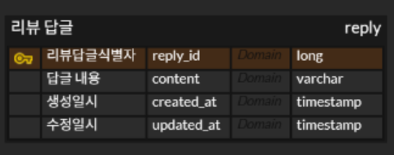

6. **문의**

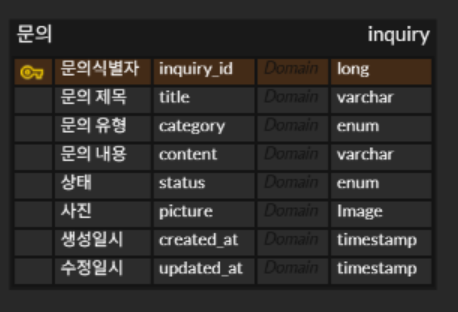

7. **음식_카테고리**

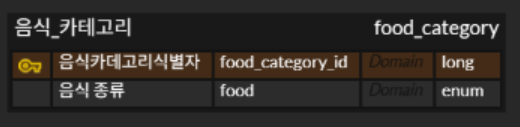

### 매핑

1. **미션, 가게**

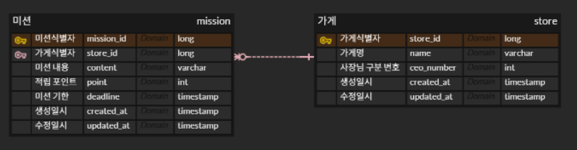

가게에 여러 미션 존재, 한 미션은 가게에 하나 존재 

2. **리뷰, 가게**

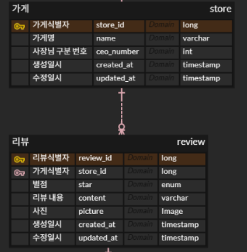

가게에 여러 리뷰 가능, 리뷰 하나가 여러 가게 불가능

3. **리뷰, 리뷰 답글**

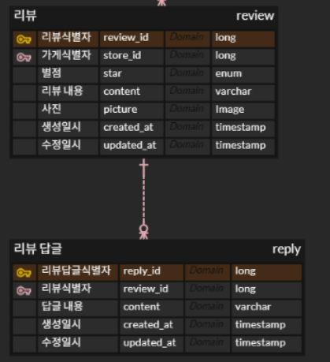

하나의 리뷰에 여러 리뷰 답글 가능, 리뷰 답글 하나에 여러 리뷰 불가

4. **유저, 문의**

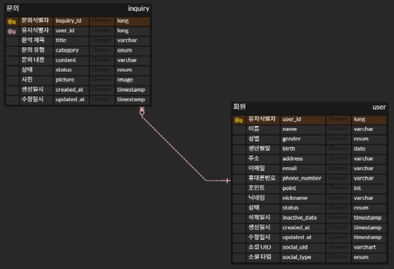
한 회원당 여러 문의 가능, 문의 하나를 여러 회원이 불가

5. **유저, 리뷰**

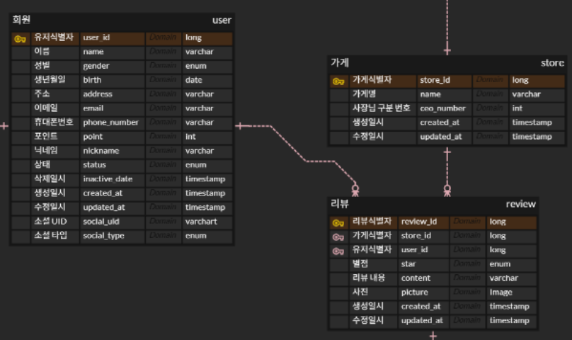

한 유저당 여러 리뷰 가능, 리뷰를 여러 유저가 작성 불가

6. **유저, 음식카테고리**

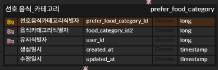

선호 음식 카테고리 매핑 테이블 생성
여러 유저가 선호 음식 여러 개 선택 가능, 여러 음식이 여러 유저한테 선택될 수 있음

7. **유저, 미션**

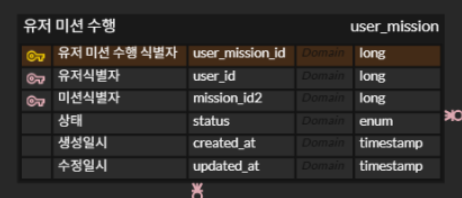
한 유저가 여러 미션 수행 가능, 여러 유저가 한 미션 수행 가능

### 최종 ERD
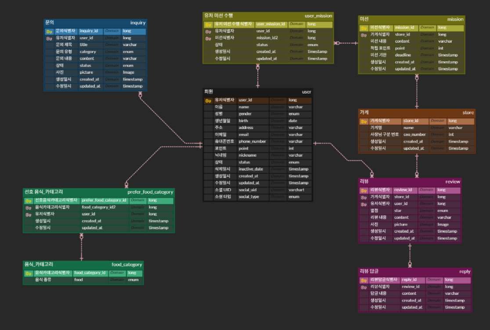

노션 링크 : https://www.notion.so/makeus-challenge/Chapter-1-Database-31fb57f4596b818888c5eb48085ee207